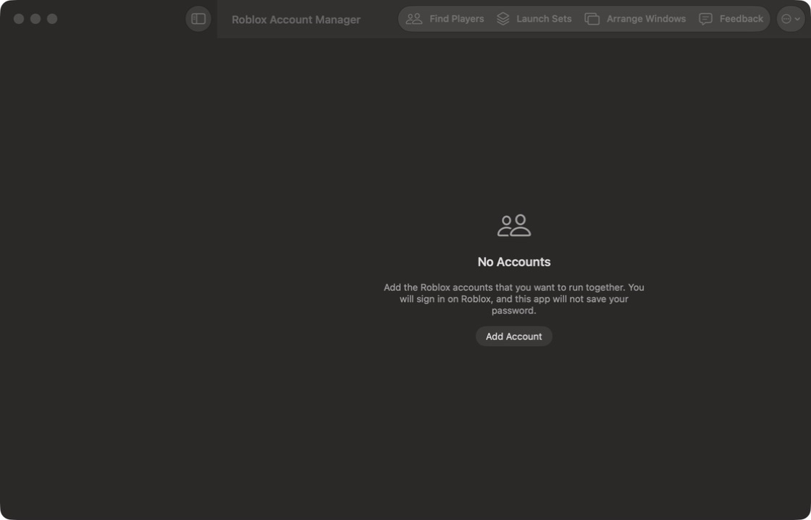
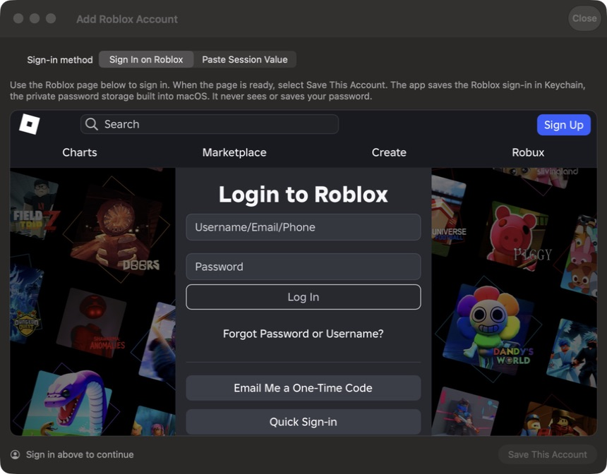

# Design QA

Latest check: August 23, 2026

## Reproducible check

- Run `./scripts/smoke-test-app.sh`.
- The script builds a universal, ad hoc-signed local app and verifies its version, bundle identifier, plist, signature, and processor architectures.
- The smoke app uses a new temporary data folder. It does not read saved accounts or Keychain items.
- Automatic account and update checks stay off during the smoke run.
- The test passes only after the main SwiftUI window reports that it appeared.

## Durable evidence

- File: `docs/design-qa/main-window-empty.png`
- Size: 1120 x 720 pixels.
- SHA-256: `3accf1b752ce5eb86a54f7fefc5d43c464cd00a310ae59e5e84619d7d3d40800`

- File: `docs/design-qa/add-account-empty.png`
- Size: 860 x 672 pixels.
- SHA-256: `971a3144a40201482d46101d0d9626c5784b3d2fa9084e0b37eb2a2e01e91983`

## Main window review

- The empty state is centered on both axes.
- The icon, heading, explanation, and action share one center line.
- The explanation has a controlled width and does not touch an edge.
- The Add Account label is centered and has clear contrast.
- The toolbar controls have visible labels and Accessibility help.
- No text, control, or window corner is clipped.
- The native sidebar, title bar, toolbar, and content surface form one consistent macOS interface.

## Add Account review

- Selecting Add Account opened the real Add Roblox Account window.
- The sign-in choice, explanation, browser, status, and save action fit inside the window.
- The app explanation has consistent left and right margins.
- Save This Account stays disabled until a valid session exists.
- No credential was entered or saved during this check.
- The Roblox page is external content and can change independently of this app.

## Design-law review

- Content is visible by default. No entrance animation hides text or controls.
- The app uses native controls, system type, system colors, and system materials.
- It has no decorative gradients, glow effects, floating cards, hover lifts, fake app windows, or fake controls.
- Custom corner sizes use the shared `AppGeometry` scale.
- Text has clear margins and readable contrast in the checked dark appearance.
- Icons are functional system symbols. They do not sit in decorative colored tiles.
- The checked controls responded to a real pointer action.

## Scope

This check covers the privacy-safe empty main window and the initial Add Account state. Logic tests cover populated account, launch, update, WebKit policy, and window-placement behavior. A release review with test accounts is still required when those populated layouts change.

Final result: passed
